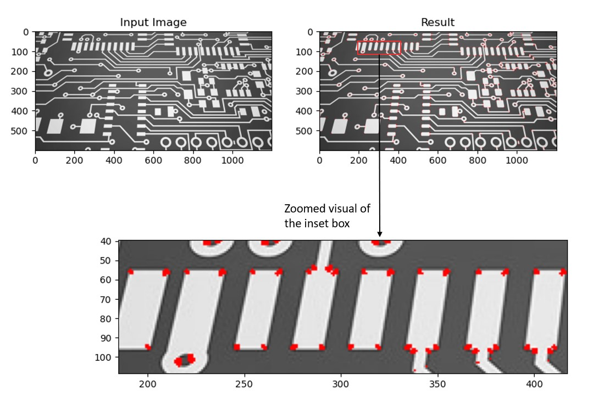

# harris-corner-detector
Implementation of the Harris Corner Detector in Python using structure tensors.

A corner is a point which is in two different and dominant edge directions. It can be interpreted as the intersection of 2 edges. Sobel filters are used to find the gradient along the x and y directions in the image. The structure tensor corresponding to the image is computed, and subsequently the corners are identified using it.

Sample input, output images. Below image indicates the zoomed in part of the output to notice more clearly the edges marked.

[Ref: Wikipedia](https://en.wikipedia.org/wiki/Harris_corner_detector)
